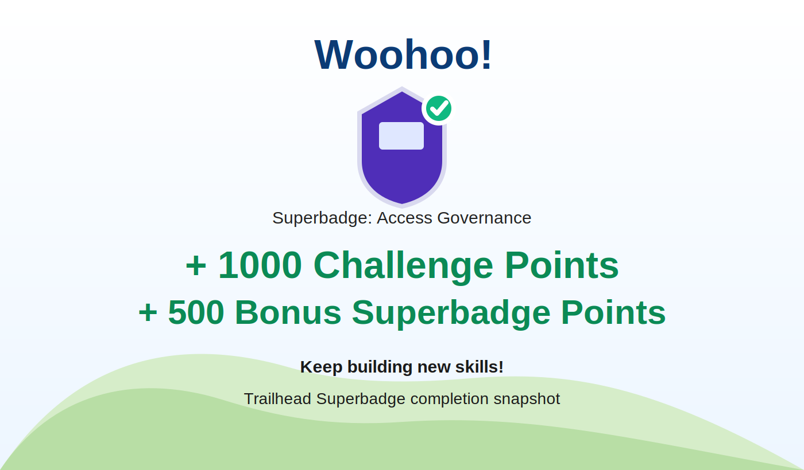

# Salesforce Access Governance

[](https://github.com/stampini81/salesforce-access-governance/actions/workflows/ci.yml)
[](https://github.com/stampini81/salesforce-access-governance/actions/workflows/salesforce-org-validation.yml)
[](https://developer.salesforce.com/)
[](./sfdx-project.json)
[](https://www.python.org/)
[](https://github.com/features/actions)
[](./LICENSE)
[](https://trailhead.salesforce.com/)

<p align="center">
  
</p>

<p align="center">
  
</p>

<p align="center">
  
</p>

Production-ready Salesforce DX repository that documents, preserves, and validates the implementation used to earn the **Salesforce Trailhead Superbadge: Access Governance**.

## Overview

This repository was organized to go beyond a one-off superbadge submission. It captures the maintainable metadata, the governance decisions, and the operational notes required to explain how the badge was achieved and how the solution can be reviewed over time.

The project includes:

- Salesforce metadata for access governance and monitoring controls
- GitHub Actions workflows for repository and metadata validation
- deployment-validation automation for authenticated Salesforce environments
- implementation notes for challenge-specific runtime and data steps
- repository hygiene with license, ignore rules, and reusable project structure

## Tools and Platform

- Salesforce CLI
- Salesforce DX project structure
- Salesforce Metadata API
- GitHub Actions
- Python 3.12
- Trailhead

## What Was Implemented to Earn the Superbadge

### Privileged Access Governance

- Reviewed privileged access across users, permission sets, and permission set groups.
- Corrected unauthorized privileged access in the org.
- Preserved temporary-access policy behavior instead of only stripping permissions.
- Enabled assignment expiration support for permission sets and permission set groups.
- Configured temporary privileged access with the expected expiration model.

### Opportunity Data Change Monitoring

- Enabled Opportunity history tracking.
- Enabled field history tracking for `CloseDate`, `OwnerId`, `StageName`, and `Amount`.
- Added the `Opportunity Field History` related list to Opportunity page layouts.
- Documented the report configuration required to monitor recent Opportunity history changes.

### Sensitive Data Exposure Mitigation

- Enabled the org setting that allows field history deletion.
- Created the temporary `Delete Field History` permission set.
- Assigned temporary access with a one-day expiration.
- Removed only the authorized `AccountHistory` records that exposed credit card data.

## Repository Structure

```text
.
|-- .github/
|   `-- workflows/
|-- assets/
|   `-- images/
|-- docs/
|   `-- superbadge-implementation-report.md
|-- force-app/
|   `-- main/default/
|-- manifest/
|   `-- package.xml
|-- scripts/
|   |-- check_repository.py
|   `-- validate_metadata.py
|-- .editorconfig
|-- .gitignore
|-- LICENSE
|-- README.md
`-- sfdx-project.json
```

## CI Workflows

### `ci.yml`

Runs on `push` and `pull_request` and validates:

- required repository structure
- critical project files
- Salesforce metadata XML well-formedness

### `salesforce-org-validation.yml`

Runs on `workflow_dispatch` and on pushes to `main` or `master` when the repository secret `SF_AUTH_URL` is configured.

This workflow:

- installs Salesforce CLI
- authenticates to a target org
- runs `sf project deploy validate` against the metadata in `force-app`

## Challenge Report

The full implementation record is available in [docs/superbadge-implementation-report.md](./docs/superbadge-implementation-report.md).

That report summarizes:

- privileged-access corrections
- Opportunity history-tracking configuration
- selective Account History cleanup
- operational constraints and validation notes

## Notes

Some superbadge requirements depend on runtime org state, data conditions, and UI actions that are not fully represented by deployable metadata alone. This repository intentionally combines source-tracked metadata with documentation so the deliverable remains reviewable, reproducible, and portfolio-ready.

## Author

**Leandro da Silva Stampini**

## License

This project is licensed under the [MIT License](./LICENSE).
